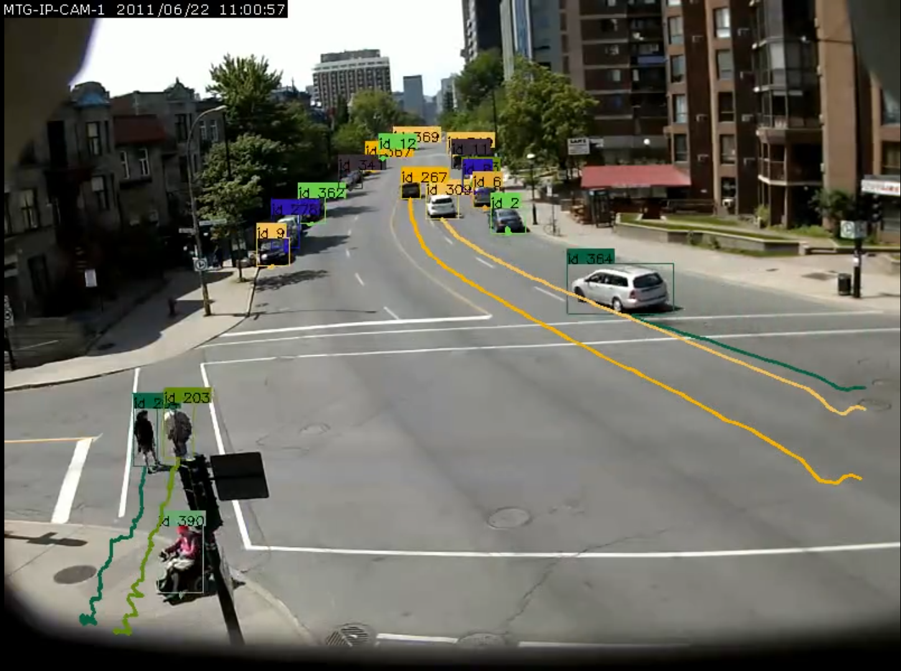

# Object Detection And Tracking

### The notebook is intended to be used with google colab.

The notebook shows how to detect and track multiple objects in a video. For detection pretrained fasterrcnn model is used, and for tracking detected objects [sort](https://github.com/abewley/sort) multiple object tracker is used.

Its very easy to modify this code to add interesting features. 
* speed calculation
* mapping location on image to geolocation

